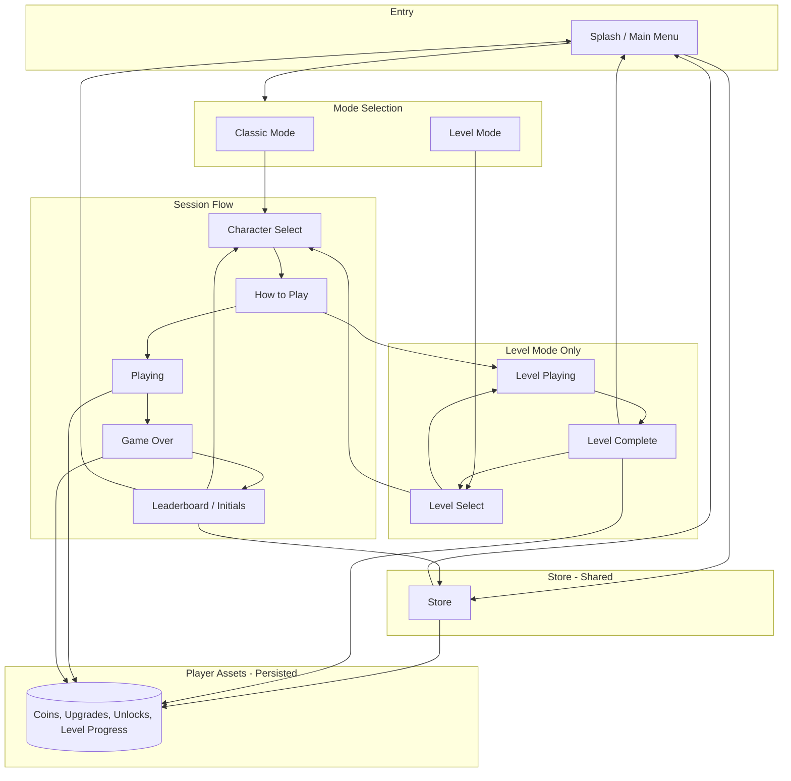
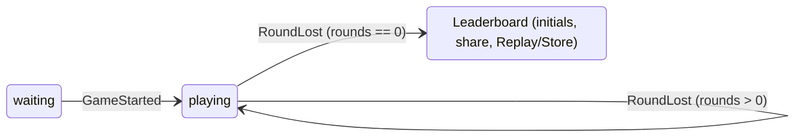

# Pinball Game – Game Flow and State Management

**Document ID:** 3_04

This document aligns with [requirements §0–§1](../requirements/Requirements.md) (system flow diagram and state machine). The game supports **Classic** and **Level** modes; the **Store** and **player assets** (coins, upgrades) are shared across both modes.

---

## 1. System Flow Overview

Main menu (Splash) offers: **Play** (Classic), **Levels** (Level Mode), and **Store**. Store is also accessible after game over. Player assets (coins, upgrades, level progress) are persisted and used in both modes.

---

## 2. App States and Transitions

| State | Description |
|-------|-------------|
| **Splash** | Main menu: Play (Classic), Levels, Store. |
| **Store** | Shop UI; buy upgrades with coins; return to Splash or (from post-game) Leaderboard. |
| **LevelSelect** | Level mode: world map or level list; select level → CharacterSelect or LevelPlaying. |
| **CharacterSelect** | User picks Sparky, Dino, Dash, or Android. |
| **HowToPlay** | How to Play screen; dismiss → Playing or LevelPlaying. |
| **Playing** | Classic: playfield active, rounds/ball, scoring. |
| **LevelPlaying** | Level: playfield with level-specific layout and objectives. |
| **GameOver** | Rounds == 0 or level failed; transition to Leaderboard. |
| **Leaderboard** | Top 10, initials, game over info, Share; Replay → CharacterSelect; optional Store. |

### 2.1 State Transition Table

| From | Event / Action | To |
|------|----------------|-----|
| Splash | Play (Classic) | CharacterSelect |
| Splash | Levels | LevelSelect |
| Splash | Store | Store |
| Store | Back / Done | Splash (or Leaderboard if from post-game) |
| LevelSelect | Level selected | CharacterSelect or LevelPlaying |
| LevelSelect | Back | Splash |
| CharacterSelect | Character selected | HowToPlay |
| HowToPlay | Dismiss | Playing or LevelPlaying |
| Playing | Last ball drained, rounds == 0 | GameOver |
| Playing | Last ball drained, rounds > 0 | Playing (new ball) |
| LevelPlaying | Objective met or failed | LevelComplete or GameOver |
| LevelComplete | Next / Replay / Back | LevelSelect or Splash |
| GameOver | — | Leaderboard |
| Leaderboard | Replay | CharacterSelect |
| Leaderboard | Store | Store |
| Leaderboard | Back to menu | Splash |

---

## 3. Start Flow (Classic)

1. **Splash** → user taps **Play** → **CharacterSelect**.
2. **CharacterSelect** → user picks theme → **HowToPlay**.
3. **HowToPlay** → dismiss → load playfield, set status = playing, spawn ball at launcher → **Playing**.

Replay (after game over): **Leaderboard** → Replay → **CharacterSelect** (same as step 1).

---

## 4. Game State (Playing / LevelPlaying)

### 4.1 Status (session)

| Status | Description |
|--------|-------------|
| waiting | Before first ball in play (e.g. camera on backbox/top) |
| playing | Ball(s) in play; scoring and multiplier active |
| gameOver | Rounds = 0; transition to Leaderboard |

### 4.2 Data (per session)

- **round_score**, **total_score**, **multiplier** (1–6), **rounds** (e.g. 3), **bonus_history**, **characterTheme**.
- **display_score** = round_score + total_score (capped 9999999999).

### 4.3 Session Transitions

### 4.4 Events and Effects

| Event | Effect |
|-------|--------|
| GameStarted | status = playing; spawn ball at launcher |
| Scored(points) | round_score += points (only when playing) |
| MultiplierIncreased | multiplier = min(6, multiplier + 1) |
| BonusActivated(bonus) | bonus_history.append(bonus); if googleWord/dashNest start 5s bonus ball timer |
| RoundLost | total_score += round_score * multiplier; round_score = 0; multiplier = 1; rounds -= 1; if rounds == 0 then gameOver else spawn ball |
| GameOver | transition to Leaderboard |
| BracketReached(bracket) | show notification; queue reward for post-game (Score Range Board, FR-6.3) |

---

## 5. Round Life Cycle (Classic)

1. **Round start**: Ball spawns at launcher; player launches.
2. **During round**: Hits add to round_score; ramp every 5 hits increases multiplier; bonuses and bonus ball (5s) for Google Word / Dash Nest.
3. **Ball drains**: Drain removes ball; if no balls left → RoundLost.
4. **RoundLost**: total_score += round_score * multiplier; reset round_score, multiplier; rounds -= 1. If rounds > 0 → new ball; if rounds == 0 → GameOver → Leaderboard.

---

## 6. Bonus Ball and Multiplier

- **Bonus ball**: Trigger = Google Word or Dash Nest; 5s timer → spawn at DinoWalls with impulse; multiball indicators (4) animate.
- **Multiplier**: Source = SpaceshipRamp (every 5 hits, max 6); reset to 1 on RoundLost.

---

## 7. Backbox Flow (Leaderboard)

- **States**: LeaderboardSuccess, LeaderboardFailure, Loading, InitialsForm, InitialsSuccess, InitialsFailure, Share.
- **Game over**: Backbox shows initials → submit → game over info → Share option; **Replay** → CharacterSelect; **Store** (optional) → Store.
- **Leaderboard display**: Top 10, sorted by score descending; each entry: rank, initials, score, character icon.

---

## 8. Level Mode Flow

- **LevelSelect**: User picks a level (from world map or list); optional CharacterSelect then HowToPlay; then **LevelPlaying**. LevelSelect may show CharacterSelect before LevelPlaying, or skip to LevelPlaying; the chosen flow is documented in UI-Design.
- **LevelPlaying**: Same physics and core mechanics as Classic; level-specific layout and objectives (e.g. target score, tasks, time limit).
- **LevelComplete**: Rewards (coins, unlocks) applied to **player assets**; then LevelSelect or Splash.
- Level progress and high scores per level are saved locally.

---

## 9. Store and Player Assets

- **Store** is entered from Splash or from Leaderboard (after game over).
- **Player assets** (coins, purchased upgrades, unlocks, level progress) are **persisted** (e.g. local storage) and **shared** across Classic and Level modes.
- Coins are earned from rounds, bonuses, score milestones, and level completion; upgrades are bought in the Store and affect both modes.

---

## 10. Camera Flow

| Game status | Camera focus | Zoom (reference) |
|-------------|-------------|------------------|
| waiting | Top (e.g. (0, -112)) | size.y / 175 |
| playing | Playfield (e.g. (0, -7.8)) | size.y / 160 |
| gameOver | Top (e.g. (0, -111)) | size.y / 100 |

On status change, tween camera position and zoom. Level mode may show level-specific HUD (e.g. objectives).
