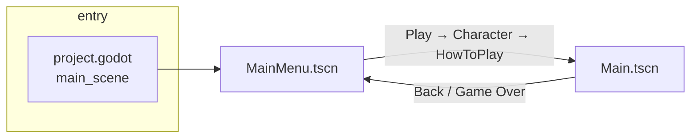
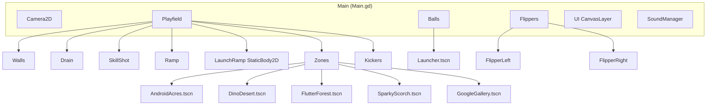

# Pinball Experience — Technical Structure

This document describes the **technical structure**, **scene tree**, **script-to-scene mapping**, and **requirements** for the game. It aligns with [Technical-Design](Technical-Design.md), [Game-Flow](Game-Flow.md), and [Requirements](../requirements/Requirements.md).

---

## 1. Project overview

- **Engine**: Godot 4.5.x
- **Language**: GDScript
- **Run/main scene**: `res://scenes/MainMenu.tscn` (entry). For development (skip menu): set to `res://scenes/Main.tscn` in project.godot.
- **Flow**: **MainMenu** → (Play → Character Select → How to Play) → **Main** (playfield); from game (Back / Game Over) → **MainMenu**.

---

## 2. Directory structure (relevant parts)

```
pinball-experience/
├── project.godot          # Main scene; autoloads; input; physics layers
├── scenes/
│   ├── Main.tscn          # Game root (playfield)
│   ├── MainMenu.tscn      # Menu (entry: Play / Levels / Store → Character → HowToPlay)
│   ├── Launcher.tscn
│   ├── FlipperLeft.tscn / FlipperRight.tscn
│   ├── Ball.tscn
│   ├── SkillShot.tscn
│   ├── Obstacle.tscn
│   ├── zones/                    # Five playfield zones (Google Gallery, Android Acres, Dino Desert, Flutter Forest, Sparky Scorch)
│   │   ├── AndroidAcres.tscn
│   │   ├── DinoDesert.tscn
│   │   ├── FlutterForest.tscn
│   │   ├── SparkyScorch.tscn
│   │   └── GoogleGallery.tscn
│   └── (future: ShopScene, AchievementUI, MobileControls, etc.)
├── scripts/               # GDScript
└── requirements/         # Requirements.md
```

---

## 3. Scene tree and flow

### 3.1 High-level scene flow



### 3.2 Main scene tree (game root)



*(Zones and Ramp/Kickers are added as features per [FEATURE-STEPS](../plan/FEATURE-STEPS.md).)*

### 3.3 MainMenu scene flow

- **PlayPanel** (initial): Play (Classic), Levels, Store.
- **CharacterPanel**: Four themes (Sparky, Dino, Dash, Android); selection stored (e.g. BackboxManager.selected_character_key).
- **HowToPlayPanel**: How to Play; Done → change scene to Main.tscn.

---

## 4. Script ↔ Scene mapping

### 4.1 Scenes and scripts

| Scene | Root script | Other scripted nodes (in same scene) |
|-------|-------------|--------------------------------------|
| **Main.tscn** | `scripts/Main.gd` | Drain → Drain.gd; SkillShot → SkillShot.gd; (future: Ramp, Kickers); UI → UI.gd; SoundManager → SoundManager.gd |
| **MainMenu.tscn** | `scripts/MainMenu.gd` | — |
| **Launcher.tscn** | `scripts/Launcher.gd` | — |
| **FlipperLeft/Right.tscn** | `scripts/Flipper.gd` | — |
| **Ball.tscn** | `scripts/Ball.gd` | — |
| **SkillShot.tscn** | `scripts/SkillShot.gd` | — |
| **Obstacle.tscn** | `scripts/Obstacle.gd` | — |
| **Zone scenes** (AndroidAcres, DinoDesert, FlutterForest, SparkyScorch, GoogleGallery) | e.g. `scripts/zones/AndroidAcres.gd` | Bumpers → Bumper.gd |

### 4.2 Autoloads (no scene root)

Registered in `project.godot` under `[autoload]`:

| Autoload name | Script | Role (brief) |
|--------------|--------|--------------|
| GameManager | GameManager.gd | Game state, rounds, score, multiplier, bonuses, signals |
| SoundManager | SoundManager.gd | Play sounds (launch, drain, flipper, hit) |
| LevelManager | LevelManager.gd | Level mode: select, data, progression |
| BackboxManager | BackboxManager.gd | Character selection (selected_character_key); (future) initials, leaderboard |
| (future) BallPool | BallPool.gd | Ball instance pool |
| (future) CoordinateConverter | CoordinateConverter.gd | Flutter ↔ Godot coordinates (bonus ball position) |

---

## 5. Scene and script requirements

### 5.1 Main.tscn requirements

- **Scripts**: Main.gd, Drain.gd, SkillShot.gd, UI.gd, SoundManager (in-scene or autoload).
- **Instanced scenes**: FlipperLeft, FlipperRight, Launcher, Ball (preload), SkillShot, Obstacles.
- **Autoloads**: GameManager (balls_container, launcher_node, ball_scene, start_game, signals).
- **Input**: flipper_left, flipper_right, launch_ball (project.godot or GameManager).
- **Node path contract**: `Camera2D`, `Balls`, `Launcher`, `Playfield`, `Playfield/Zones`, `UI/BackToMenuButton`, `Flippers`.

### 5.2 MainMenu.tscn requirements

- **Script**: MainMenu.gd.
- **Autoloads**: (future) BackboxManager for selected_character_key.
- **Node path contract**: `PlayPanel`, `CharacterPanel`, `HowToPlayPanel`, `PlayPanel/VBox/PlayButton`, `CharacterPanel/VBox/HBox/Character1..4`, `HowToPlayPanel/VBox/DoneButton`.

### 5.3 Main.gd requirements

- **Requires**: GameManager; nodes: Camera2D, Balls, Launcher, UI/BackToMenuButton, Flippers; Ball.tscn.
- **Provides**: Wires GameManager to scene (balls_container, launcher_node, ball_scene); connects back button, game_over, game_started, bonus_activated; multiball indicators; optional mobile controls; camera per status.

### 5.4 MainMenu.gd requirements

- **Requires**: (future) BackboxManager; UI nodes for Play / Character / HowToPlay panels and buttons.
- **Provides**: Flow INITIAL → SELECT_CHARACTER → HOW_TO_PLAY; scene change to Main.

### 5.5 GameManager requirements

- **Requires**: balls_container and ball_scene set by Main; launcher_node set by Main; (optional) BallPool.
- **Provides**: Status, rounds, scoring, multiplier, bonuses, signals (scored, game_over, game_started, bonus_activated, round_lost, ball_spawn_requested).

### 5.6 Launcher.gd requirements

- **Requires**: GameManager sets this as launcher_node and provides ball via set_ball or ball_spawn_requested.
- **Provides**: Plunger charge, ball_launched(force), capture cooldown.

### 5.7 Drain / SkillShot / Ramp / Kicker (current or future)

- **Require**: GameManager (scoring, round_lost, signals); body_entered/area_entered for ball.
- **Provide**: Drain → round loss; SkillShot → 1M points; Ramp → ramp scoring + multiplier; Kickers → 5k each.

---

## 6. Physics layers (project.godot)

- **Layer 1**: Ball
- **Layer 2**: Flippers
- **Layer 4**: Walls (or 3 per current project; align to one convention)
- **Layer 8**: Obstacles

*(Current project uses layer_3 for walls, layer_4 for obstacles; [Physics-Specifications](details/Physics-Specifications.md) and project.godot should be aligned.)*

---

## 7. Input actions (project.godot)

| Action | Desktop | Purpose |
|--------|---------|---------|
| flipper_left | Left Arrow, A | Left flipper |
| flipper_right | Right Arrow, D | Right flipper |
| launch_ball | Space, Down Arrow | Launch ball |

---

## 8. Reuse and reference

- [Technical-Design](Technical-Design.md) — architecture and layers
- [Game-Flow](Game-Flow.md) — state machine and transitions
- [FEATURE-STEPS](../plan/FEATURE-STEPS.md) — incremental feature steps
- [Requirements](../requirements/Requirements.md) — FR/NFR/TR
