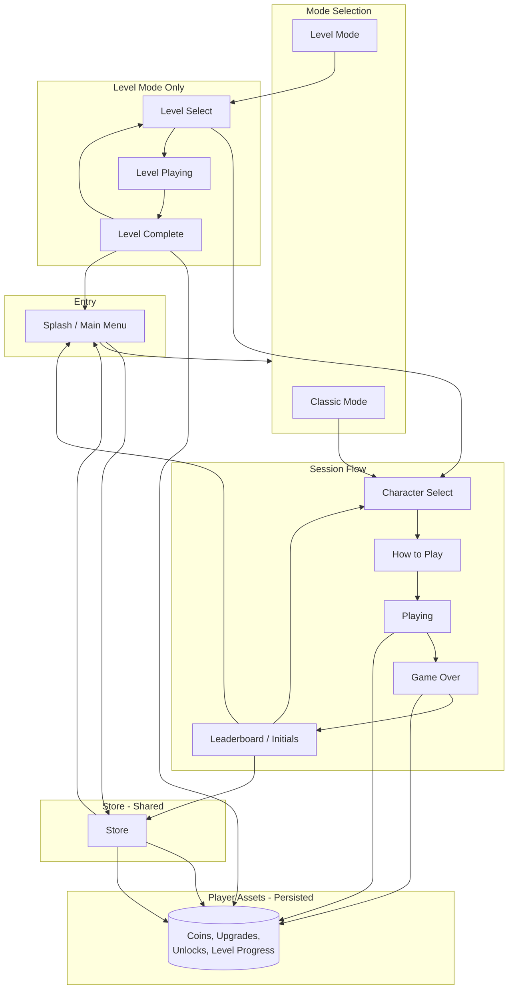

# Pinball Game – Requirements Specification

**Document ID:** 2_01

## Document Information

- **Game Title**: Pinball (I/O Pinball–inspired, with Shop, Score Board, Level Mode)
- **Version**: 2.0
- **Source**: Same core functions and game design as Flutter I/O Pinball (Google I/O 2022); extended with shopping, score range board, and level mode.
- **Engine**: Godot 4.5.1
- **Platform**: Desktop and mobile (no Firebase required; leaderboard/share via local or optional backend)

---

## 0. System Flow Diagram

The following diagram describes the high-level flow: mode selection (Classic vs Level), Store (shared for both modes), and that **player assets (coins, upgrades) are recorded and shared across both modes**.



**Summary:** The **Store** is accessible from the main menu and after game over. **Classic** and **Level** modes both use the same **player assets** (coins, purchased upgrades, unlocks); the game shall record and persist these for the player across sessions and across both modes.

---

## 0.1 Definitions

| Term | Definition |
|------|------------|
| **round** | One ball life; starts when ball spawns at launcher, ends when ball drains. |
| **bonus** | A named achievement (e.g. googleWord, dashNest) recorded in bonusHistory. |
| **bonus ball** | Extra ball spawned after 5 s when googleWord or dashNest bonus triggers. |
| **player assets** | Coins, purchased upgrades, unlocks, level progress; persisted and shared across Classic and Level modes. |
| **bracket** | Score range (e.g. 0–100k, 100k–500k) used by Score Range Board for rewards. |
| **status** | Session state: waiting \| playing \| gameOver. |
| **drain** | Area at bottom of playfield; ball contact removes ball and may trigger round lost. |
| **launcher** | Position where ball spawns at round start; includes plunger for user launch. |
| **multiball indicator** | One of four lights that animate when a bonus ball is earned. |

See [plan/GLOSSARY.md](../plan/GLOSSARY.md) for full glossary.

---

## 1. State Machine and Transitions

### 1.1 App States

| State | Description |
|-------|-------------|
| `Splash` | App start; main menu with Play, Store, and mode choice (Classic / Levels). |
| `Store` | Shop UI; buy upgrades with coins; return to Splash or (after game over) to Leaderboard/Replay. |
| `LevelSelect` | Level mode only: world map or level list; select level → CharacterSelect or LevelPlaying. |
| `CharacterSelect` | User picks one of four themes (Sparky, Dino, Dash, Android). |
| `HowToPlay` | How to Play screen; dismiss → start game. |
| `Playing` | Classic mode: playfield active, round/ball in play, scoring. |
| `LevelPlaying` | Level mode: playfield with level-specific layout and objectives. |
| `GameOver` | Rounds == 0 (or level failed); transition to Leaderboard. |
| `Leaderboard` | Top 10, initials input, game over info, Share; Replay → CharacterSelect; optional Store. |

### 1.2 State Transitions

| From | Event / Action | To |
|------|----------------|-----|
| Splash | Play (Classic) | CharacterSelect |
| Splash | Levels | LevelSelect |
| Splash | Store | Store |
| Store | Back / Done | Splash (or Leaderboard if entered from post-game) |
| LevelSelect | Level selected | CharacterSelect or LevelPlaying (per design) |
| LevelSelect | Back | Splash |
| CharacterSelect | Character selected | HowToPlay |
| HowToPlay | Dismiss | Playing or LevelPlaying |
| Playing | Last ball drained, rounds == 0 | GameOver |
| Playing | Last ball drained, rounds > 0 | Playing (new ball at launcher) |
| LevelPlaying | Level objective met or failed | LevelComplete or GameOver |
| LevelComplete | Next / Replay / Back | LevelSelect or Splash |
| GameOver | — | Leaderboard |
| Leaderboard | Replay | CharacterSelect |
| Leaderboard | Store | Store |
| Leaderboard | Back to menu | Splash |

---

## 2. Functional Requirements

### 2.1 Start Flow and Main Menu

- **FR-1.1.1**: App shall show an initial screen (main menu) with: **Play** (Classic), **Levels** (Level Mode), and **Store**. *(Updated: mode selection and Store.)*
- **FR-1.1.2**: On Play (Classic), the app shall show Character selection (four themes: Sparky, Dino, Dash, Android).
- **FR-1.1.3**: On character selected, the app shall show How to Play screen.
- **FR-1.1.4**: On How to Play finished, the app shall start the game (transition to playfield, game status = playing).
- **FR-1.1.5**: On Replay (after game over), the app shall return to Character selection.

### 2.2 Game State

- **FR-1.2.1**: Game shall maintain the following state. Data structure (machine-readable):

```json
{
  "roundScore": 0,
  "totalScore": 0,
  "multiplier": 1,
  "rounds": 3,
  "bonusHistory": [],
  "status": "waiting | playing | gameOver",
  "characterTheme": "sparky | dino | dash | android"
}
```

- **FR-1.2.2**: Display score = roundScore + totalScore; capped at 9999999999. The `scored` signal and display_score shall use this cap.
- **FR-1.2.3**: On round lost: totalScore += roundScore * multiplier (capped); roundScore = 0; multiplier = 1; rounds -= 1; if rounds == 0 then status = gameOver.
- **FR-1.2.4**: Scoring shall apply only when status == playing; roundScore shall increase by points from hits.

### 2.3 Rounds and Ball

- **FR-1.3.1**: Game shall have 3 rounds (or level-specific); when all balls of a round are lost, the round ends and the next round starts (new ball at launcher) until rounds reach 0.
- **FR-1.3.2**: When the last ball of a round drains, the game shall emit RoundLost logic (update totalScore, roundScore, multiplier, rounds, status).
- **FR-1.3.3**: A new ball shall spawn at the launcher (plunger position) when a round starts (game start or after round lost) while status is playing.
- **FR-1.3.4**: Bonus ball shall spawn after 5 seconds from a defined position (DinoWalls area) with an impulse toward the center when triggered by Google Word or Dash Nest bonus. Bonus ball spawn uses **one** shared 5 s timer; if a second bonus (e.g. both googleWord and dashNest) triggers before spawn, extend or reset the timer per design — only one bonus ball spawns per trigger cycle.

### 2.4 Scoring and Points

Point values and **trigger → points** mapping (for unambiguous assignment):

| Trigger (event / component) | Points | Notes |
|-----------------------------|--------|--------|
| Ball enters Area2D `SkillShot` (or equivalent) | 1,000,000 | Skill shot |
| Ball enters `GoogleRolloverLeft` / `GoogleRolloverRight` | 5,000 | Each |
| Ball contacts Kicker (left/right) | 5,000 | Each |
| Ball contacts Signpost (Flutter Forest) | 5,000 | |
| Ball contacts Android/Dash/Sparky bumper (A, B, COW, etc.) | 20,000 | Per bumper |
| Ball contacts main Dash bumper | 200,000 | |
| Ball enters Dino mouth sensor / Sparky computer sensor / Android spaceship sensor | 200,000 | Plus bonus |
| Ball enters SpaceshipRamp (ramp shot) | 5,000 | |
| Ramp bonus (e.g. N hits in round) | 1,000,000 | When condition met |

- **FR-1.4.1**: Point values shall be: 5000, 20000, 200000, 1000000 (as in table above).
- **FR-1.4.2**: Skill shot shall award 1,000,000 points.
- **FR-1.4.3**: Rollovers (Google), Kicker, Signpost shall award 5,000 points.
- **FR-1.4.4**: Android/Dash/Sparky bumpers 20,000; main Dash bumper and animatronic/computer/dino mouth targets 200,000 where specified.
- **FR-1.4.5**: Ramp shot 5,000; ramp bonus 1,000,000.
- **FR-1.4.6**: Score popups (5k, 20k, 200k, 1M) shall be shown when scoring (optional but recommended).

### 2.5 Multiplier

- **FR-1.5.1**: Multiplier shall range from 1 to 6.
- **FR-1.5.2**: Multiplier shall increase by 1 when the ball completes 5 ramp hits (SpaceshipRamp); at 6, no further increase from ramp.
- **FR-1.5.3**: Multiplier shall reset to 1 on round lost.
- **FR-1.5.4**: Multiplier shall be applied to roundScore when the round ends (totalScore += roundScore * multiplier).

### 2.6 Bonuses

- **FR-1.6.1**: Bonuses shall be: googleWord, dashNest, sparkyTurboCharge, dinoChomp, androidSpaceship.
- **FR-1.6.2**: Google Word bonus: when all Google letters are lit, award bonus and trigger bonus ball (after 5s).
- **FR-1.6.3**: Dash Nest bonus: when all Dash bumpers are lit, award bonus and trigger bonus ball (after 5s).
- **FR-1.6.4**: Sparky Turbo Charge, Dino Chomp, Android Spaceship: award bonus when ball enters the corresponding target.
- **FR-1.6.5**: Bonus history shall be recorded and shown (e.g. backbox or HUD) and used for multiball indicator logic.

**Bonus table** (trigger → effect):

| Bonus ID | Trigger | Effect |
|----------|---------|--------|
| googleWord | All Google letters lit | Bonus recorded; bonus ball spawn after 5 s |
| dashNest | All Dash bumpers lit | Bonus recorded; bonus ball spawn after 5 s |
| sparkyTurboCharge | Ball enters Sparky computer target | Bonus recorded; 200k points |
| dinoChomp | Ball enters Chrome Dino mouth | Bonus recorded; 200k points |
| androidSpaceship | Ball enters Android spaceship target | Bonus recorded; 200k points |

### 2.7 Playfield Zones and Components

- **FR-1.7.1**: Playfield shall include: Backbox, Google Gallery, Multipliers, Multiballs (indicators), Skill Shot, Android Acres, Dino Desert, Flutter Forest, Sparky Scorch, Drain, Bottom Group (flippers, baseboard, kickers), Launcher.
- **FR-1.7.2**: Launcher shall include: launch ramp, flapper, plunger, rocket sprite; ball launched by user action.
- **FR-1.7.3**: Drain shall remove the ball on contact and trigger round-lost logic when no balls remain.
- **FR-1.7.4**: Flippers and plunger input shall follow the mapping below.

#### Input Mapping

| Action | Desktop | Mobile |
|--------|---------|--------|
| Left flipper | Left Arrow, A | Touch left half of playfield/screen |
| Right flipper | Right Arrow, D | Touch right half of playfield/screen |
| Plunger / launch | Space, Down Arrow | Tap on plunger/launcher zone |
| Pause | Esc | (Optional) Pause button |

- **FR-1.7.5**–**FR-1.7.10**: (Android Acres, Dino Desert, Google Gallery, Flutter Forest, Sparky Scorch, Multipliers, Multiballs — as in original specification.)

### 2.8 Backbox and Game Over

- **FR-1.8.1**: Backbox shall display: **loading**, **leaderboard**, **initials form**, **game over info**, **share**. Each is a distinct UI view; switching is driven by backbox state.
- **FR-1.8.2**: When game over (rounds == 0), backbox shall show initials input; on submit, store entry (local or mock leaderboard) and show game over info with option to share and optional **Store** entry.
- **FR-1.8.3**: **Leaderboard** shall display exactly: top 10 entries, sorted by score descending; each entry shows **rank**, **initials** (3 chars), **score**, **character icon**. May be local/mock without Firebase.
- **FR-1.8.4**: Share shall offer same UX as Flutter (e.g. copy score text or share URL); implementation may be local (copy/share dialog) without Firebase.

### 2.9 Character Selection

- **FR-1.9.1**: Four character themes shall be selectable: Sparky, Dino, Dash, Android.
- **FR-1.9.2**: Selected theme shall determine ball asset and leaderboard icon for the session; it may also influence which Store upgrades are available or themed (e.g. Dino-themed upgrades for Dino character). *(Updated: link to Store/upgrades.)*
- **FR-1.9.3**: How to Play shall be shown after character selection and before play.

### 2.10 Camera and HUD

- **FR-1.10.1**: Camera shall focus/zoom: waiting (top of board), playing (playfield), game over (top).
- **FR-1.10.2**: HUD shall show score, multiplier, and rounds when playing and not game over.
- **FR-1.10.3**: Overlays: Play button (before play), Replay button (after game over), optional mobile controls overlay when entering initials on mobile.

---

## 3. Non-Functional Requirements

- **NFR-2.1**: Game shall run at **60 FPS** (target frame rate) on supported platforms.
- **NFR-2.2**: Input latency for flippers and plunger shall be minimal (responsive).
- **NFR-2.3**: Game shall be playable on desktop (keyboard) and mobile (touch) per input mapping table.
- **NFR-2.4**: No dependency on Firebase; leaderboard and share shall work with local storage or optional backend.

---

## 4. Technical Requirements

- **TR-3.1**: Engine: Godot 4.5.1.
- **TR-3.2**: Physics: 2D physics. **Exact parameters** (for consistent behavior across platforms):

| Material / Body | Gravity (world) | Restitution (bounce) | Friction | Notes |
|-----------------|-----------------|----------------------|----------|--------|
| Ball | 30 units/s² (Flutter ref) or 980 (Godot default) | 0.8 | 0.3 | CircleShape2D; mass 0.5. See [Physics-Specifications](../design/details/Physics-Specifications.md) for Godot coordinate system. |
| Flipper | 0 (kinematic) | 0.6 | 0.5 | RigidBody2D or kinematic |
| Bumper | — | 0.95 | 0.2 | StaticBody2D or Area2D |
| Wall / boundary | — | 0.7 | 0.3 | StaticBody2D |
| Playfield (floor) | — | — | 0.075 | Reference Flutter/v3.0 |

Board dimensions reference: 101.6 × 143.8 (Flutter); Godot may scale to fit viewport.

- **TR-3.3**: State management shall support all states and transitions in §1 (State Machine).
- **TR-3.4**: **Signals / events** (minimum set; payloads for machine readability):

| Signal | Payload | Emitter / use |
|--------|---------|----------------|
| `scored` | `points: int`, `source: String` | When a scoring trigger fires (source = e.g. "SkillShot", "GoogleRollover") |
| `round_lost` | `final_round_score: int`, `multiplier: int` | When last ball of round drains |
| `bonus_activated` | `bonus_type: String` | When a bonus is awarded (googleWord, dashNest, etc.) |
| `multiplier_increased` | `new_value: int` | When multiplier increases (e.g. ramp) |
| `game_over` | `final_score: int` | When rounds == 0 |
| `game_started` | — | When play session starts (ball spawn at launcher) |

Backbox events: e.g. `leaderboard_loaded`, `initials_submitted`, `share_requested`.

---

## 5. Shopping & Progression

The **Store** is available from the main menu and after game over. **Coins** and **upgrades** are **player assets**: the game shall record and persist them for the player and use them in **both Classic and Level modes**.

### 5.1 Store Access and Currency

- **FR-5.1.1**: The game shall include a **Store** accessible from the main menu and after game over (optional entry from leaderboard/game over screen).
- **FR-5.1.2**: Players earn **Coins** by:
  - Completing rounds (e.g. 100 coins per round survived),
  - Achieving bonuses (e.g. 500 coins per bonus type),
  - Reaching score milestones (e.g. 1,000 coins for 1M points),
  - Completing level objectives (see §7).
- **FR-5.1.3**: Coins and purchased upgrades shall be **persisted** (local storage) and **shared** across Classic and Level modes; the game shall record and load these player assets on session start.

### 5.2 Upgradable Items

- **FR-5.2.1**: The store shall offer the following upgradable items (each with one or more tiers):
  - **Balls**: e.g. steel (higher restitution), magnetic (slower drain), lightweight (faster).
  - **Flippers**: e.g. increased size, strength, or reaction time.
  - **Plunger**: e.g. more precise launch control or automatic full-power option.
  - **Bumpers**: e.g. temporary score multipliers on specific bumpers.
  - **Multiplier Boost**: start each round with multiplier > 1.
  - **Extra Ball**: start with an additional round.
- **FR-5.2.2**: Upgrades are purchased with coins; each item is either **permanent** (unlocked) or **consumable** (per game). Persistence mechanism: local storage (e.g. JSON or Godot save).
- **FR-5.2.3**: The selected character theme may affect available or themed upgrades (e.g. Dino-themed upgrades for Dino character).

---

## 6. Score Range Board

- **FR-6.1**: The game shall include a **Score Range Board** accessible from the main menu or as an overlay during gameplay.
- **FR-6.2**: The board shall display predefined score brackets (e.g. 0–100k, 100k–500k, 500k–1M, 1M–5M, 5M+) with corresponding rewards (e.g. coin bonuses, unlockable items).
- **FR-6.3**: When a player reaches a new bracket during a game, a notification shall appear, and the reward (if any) is granted post-game (e.g. coins added to player assets).
- **FR-6.4**: The board shall update in real time to show current progress toward the next bracket (e.g. progress bar or highlight).

---

## 7. Level Mode

Level mode uses the **same physics and core mechanics** as Classic mode and the **same player assets** (coins, upgrades). Each level has a custom layout and optional objectives.

- **FR-7.1**: The game shall have a **Level Mode** selectable from the main menu, separate from Classic (endless) mode.
- **FR-7.2**: Levels are organized in a progression (e.g. world map or list) with increasing difficulty.
- **FR-7.3**: Each level features a custom playfield layout (different bumper placements, ramp angles, hazards) while reusing core components (flippers, drain, launcher).
- **FR-7.4**: Level objectives may include: reach a target score; complete a set of tasks (e.g. light all Google letters, hit all bumpers); survive a time limit.
- **FR-7.5**: Completing a level rewards coins and may unlock new levels or upgrades; rewards are applied to the same player assets used in the Store and Classic mode.
- **FR-7.6**: Level progress and high scores per level shall be saved locally.
- **FR-7.7**: Level mode shall use the same physics (TR-3.2) and core mechanics as Classic mode, with level-specific scoring rules or bonus objectives where defined.
- **FR-7.8**: Level data format (e.g. JSON schema or Godot resource) is defined in [Technical Design](../design/Technical-Design.md).

---

## 8. Out of Scope

- Firebase Authentication or Firestore (optional; can use local/mock leaderboard and share).
- Real-money in-app purchases (in-scope: virtual coins and in-game Store only).
